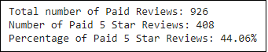
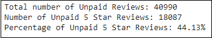

# Amazon Vine Analysis

## Overview
In this project we are analyzing Amazon reviews written by members of the paid Amazon Vine program. The Amazon Vine program is a service that allows manufacturers and publishers to receive reviews for their products. Companies pay a small fee to Amazon and provide products to Amazon Vine members, who are then required to publish a review.

We will access one of the approximately 50 datasets, containing reviews of the products. Then we will use PySpark to perform ETL process to extract data, transform data, connect to AWS RDS instance, and load the transformed data in pgAdmin. Next, we'll use PySpark to determine if there is any bias toward favorable reviews from Vine members in your dataset. Finally, we will write a summary of analysis. 

**Data Source:** https://s3.amazonaws.com/amazon-reviews-pds/tsv/amazon_reviews_us_Office_Products_v1_00.tsv.gz

**Softwares Used:** Google Colaboratory, AWS RDS, pgAdmin 4

**Languages Used:** PySpark (Spark 3.1.1), PostgreSQL

## Results

### Screenshots
Screenshot of Results for Paid (Vine) Reviews:

Screenshot of Results for Unpaid (Non-Vine) Reviews:

### Observations
* **How many Vine reviews and non-Vine reviews were there?**
    
  **Ans:** There are total of 926 Vine (paid) reviews and 40,990 non-Vine (unpaid) reviews

* **How many Vine reviews were 5 stars? How many non-Vine reviews were 5 stars?**
    
  **Ans:** 408 Vine reviews were 5 stars. 18087 non-Vine reviews were 5 stars.

* **What percentage of Vine reviews were 5 stars? What percentage of non-Vine reviews were 5 stars?**

  **Ans:** 44.06% of Vine reviews were 5 stars. 44.13% non-Vine reviews were 5 stars.

## Summary

There is *no bias* towards favorable reviews from Vine members. This seems to be supported by the fact that the percentage of Vine reviews with 5 stars (44.06%) is approximately the same as the percentage of non-Vine reviews with 5 starts (44.13%). 

### Additional Analysis

To support our analysis further, we can look at the percentage of reviews with 1 star and 2 stars in paid (Vine) reviews and unpaid (non-Vine) reviews. If the percentage of low-stars reviews from Vine members is approximately same or more than low-stars reviews from non-Vine customers, then it would support our statement that there is no bias for favorable reviews from Vine customers.  